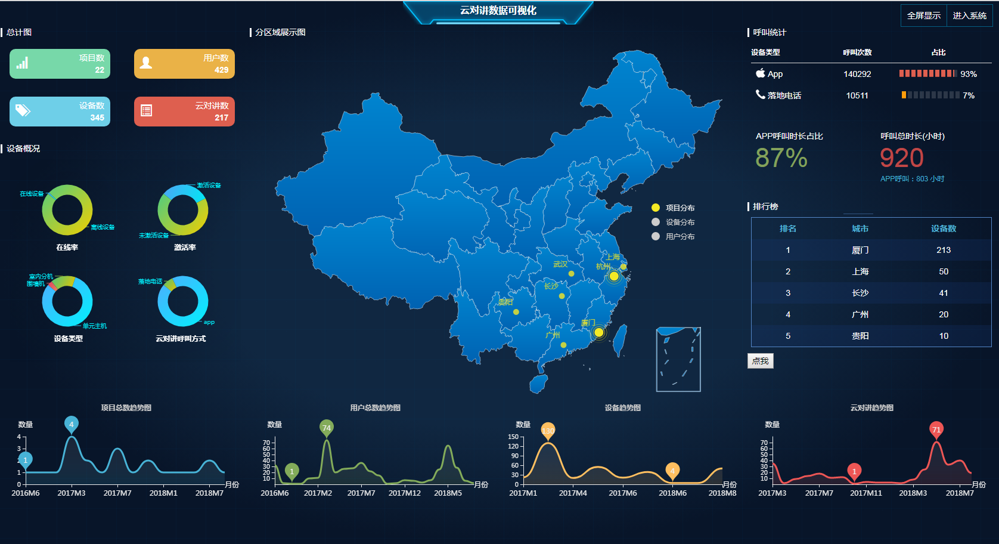
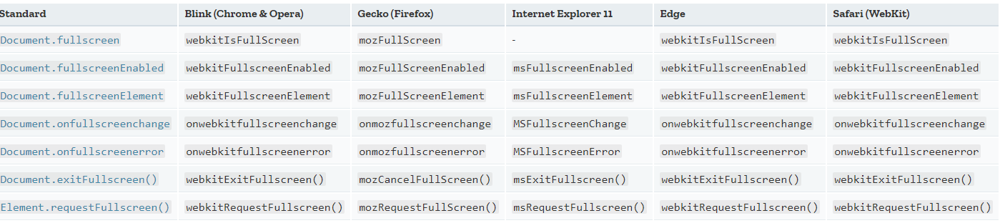

# FullScreen 全屏如何调用

## 前言
最近用echarts做了一个大数据看板，效果图如下


在普通台式机屏幕表现还可以，但在14寸笔记本上看，不得不出现滚动条，以保证内容展示的美观性。所以，便加了一个全屏显示的功能。

## 坑

虽然大部分浏览器设置了全屏显示的快捷键，但此处要用JS调用window（document）的接口。因为各大浏览器对FullScreen API都是私有实现，所以有了些坑。


* 坑一： 各大浏览器提供给JS调用的都是前缀版本，命名各不同，我还掉入了拼写的坑。
* 坑二： 请求全屏的方法requestFullscreen()需要通过Element调用，目前发现IE的document.documentElement上没有绑定该方法，其他浏览器则是支持通过document.documentElement的。IE我通过body元素来调用。

## 上代码
```js

var fullScreen = {
    isEnable: (function () {
        return document.fullscreenEnabled || document.mozFullScreenEnabled || document.webkitFullscreenEnabled || document.msFullscreenEnabled;
    })(),
    requestFullscreen: (function () {
        var elem = document.documentElement;
        var requestMethod = elem.requestFullScreen || //W3C
                elem.webkitRequestFullScreen ||    //Chrome等
                elem.mozRequestFullScreen || //FireFox
                elem.msRequestFullscreen; //IE11
        if (requestMethod) {
            return function () {
                if (window.navigator.userAgent.indexOf("MSIE")) {
                     requestMethod.call(document.body); //IE的document上无法使用requestFullscreen事件，要用在body上
                } else {
                    requestMethod.call(elem);

                }
            }
        } else {
            //throw new Error("该浏览器不支持全屏事件");
        }
    })(),
    exitFullscreen: (function () {
        var exitMethod = document.exitFullscreen || //W3C
                document.mozCancelFullScreen ||    //Chrome等
                document.webkitExitFullscreen || //FireFox
                document.msExitFullscreen; //IE11
        if (exitMethod) {
            return function () {
                exitMethod.call( document );
            }
        }
    })(),
    fullscreenElement: function () {
        return document.webkitFullscreenElement || document.mozFullScreenElement || document.msFullscreenElement || document.fullscreenElement;
    },
    btnDom: document.getElementById('fullScreen-btn')
}
```


https://developer.mozilla.org/en-US/docs/Web/API/Fullscreen_API