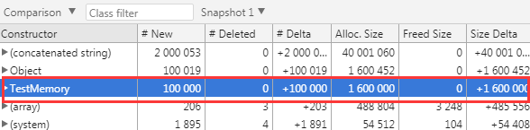
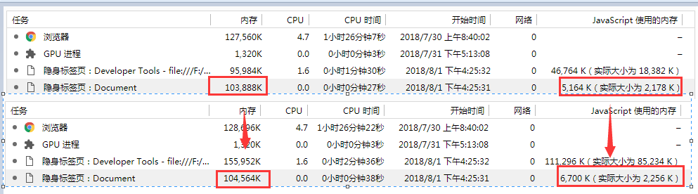

谈下浏览器的性能以及优化
================

## 略长的前言
今天码代码的时候用到了闭包，闭包在平时也常用到，谈到JS就难免谈到闭包，谈到闭包就难免谈到内存泄露。但是！我从来没有写出让浏览器崩溃的代码(真的，主要我做的都不是大应用且现在浏览器不断升级，也很耐操)，虽然之前也知道教程书里的对内存泄露、性能优化等各种云云（大坑）,当真的没有稍微深入了解过，只知道哎呀，要积极主动释放掉不用的引用对象（也基本在setInterval,setTimeout上用而已)，要减少闭包的使用（摔，根本不是，而是要善用闭包），反正就是了解得非常肤浅，所以趁着对闭包深入了解的基础上，收集翻阅了一些资料，来对浏览器性能以及优化稍微深入了解一下。

## 浏览器引擎
 各大厂商的浏览器引擎Tridend(IE)、Gecko(FF)、WebKit(Safari,Chrome,Andriod浏览器)之间存在实现差异，也有不少私有属性和方法，但是统一标准化大潮也在推进中。随着移动互联的发展，还是以V8引擎来作为主要研究对象。我们说性能优化，很多时候是在说对内存的优化。因此，我们需要知道V8对内存的使用机制。

 贴一张谷歌浏览器架构图：
,

 ## V8 内存机制

首先要知道栈内存和堆内存。栈内存存放直接直接类型，以及对象类型的引用。我们用DevTool查看内存分析时，可以看到
,

这里 `Shallow Size`表示栈内存的大小，`Retained`表示包含了堆内存对象的大小。因此，Retained 只会比 Shallow 大。

V8使用垃圾回收机制以释放内存，提高运行速度，这个过程对用户是透明的。因为不当操作，致使对象留在内存内，无法回收，就产生了我们说的内存溢出或泄露。


## 进行试验
当浏览器的内存被占满（超过最大值）时，浏览器就会崩溃。
所有new 出来的对象，在有被引用的情况下，都会保存在内存里，先来一个简单的代码看一下。

假设一个页面上什么都没有，我们用匿名方式打开一个页面(为了减少其他因素的影响)，再打开任务管理器，可以看到这个页面内存的使用情况。
,
然后执行下面代码，在页面里创建十万个对象。
```js
    function btnClick(){
          //创建对象
          console.log("创建大量对象-十万个")
          for( var i =0 ;i< 100000 ;i++){
            var _ = new TestMemory();
            arr.push(_)
          }
          console.log("创建完毕");
    }

```

再来观察下内存使用情况：
,
可以看到内存暴增了40多兆。

通过DevTools的 Heap Snapshot，即堆快照可以看出，TestMemory对象增加了十万个，删除了0个，也就是说，全部留在内存里。（注：这个实验主要测试内存溢出，而非内存泄露; 这里的实验纯粹是暴力生成巨量对象，以达到观察内存无法满足需求的情况）



如果换个写法，

```js
    function btnClick(){
          //创建对象
          console.log("创建大量对象-十万个")
          for( var i =0 ;i< 100000 ;i++){
             //生成巨量对象，但不引用这些对象，即创建对象都是匿名的
             new TestMemory();
          }
          console.log("创建完毕");
    }

```

同样地观察创建对象前后内存的使用情况：


发现内存没有暴增，再开看看堆快照的对比情况,情况是堆快照里面根本TestMemory对象。原因是因为新创建的对象明没有变量引用，因此函数执行完毕之后，这十万个对象被垃圾回收机制回收了！ 

讲到这里，再次回头来看看闭包: 函数外部的变量引用了函数内部的变量，导致函数执行完毕之后，内部变量无法得到释放，于是就形成了闭包。而已造成了 `内存泄露`，如果闭包造成过多对象留在内存，就像我们实验的那么多，超过浏览器的能承受的上限，就会`内存溢出`了！浏览器会有崩溃的可能。

所以说，`内存溢出的可能诱因是内存泄露`。

## 防止内存泄露的方法


## 参考

<a href="https://blog.csdn.net/taoerchun/article/details/51480949">一、JS内存泄漏排查方法

<a href="https://blog.csdn.net/bug_zero/article/details/54883083">二、Chrome开发者工具之JavaScript内存分析

<a href="https://blog.csdn.net/swimming_in_it_/article/details/78869549">三、V8引擎详解


<a href="http://www.cnblogs.com/wangjiming/p/6357306.html">四、详解谷歌浏览器

<a href="https://blog.csdn.net/ruiruihahaha/article/details/70270574">五、内存泄露和内存溢出的关系

