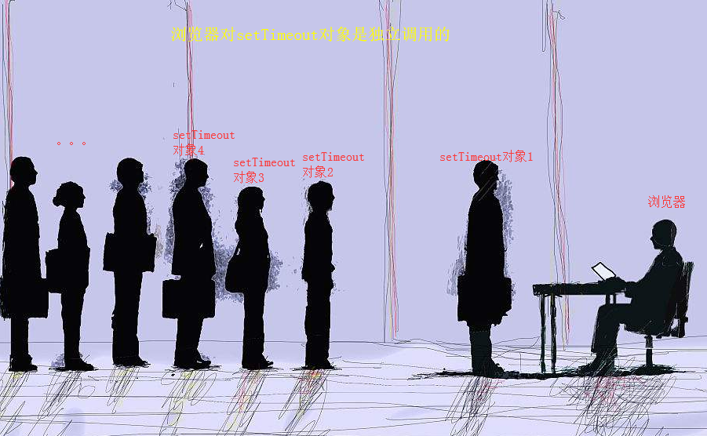

requestAnimationFrame的学习笔记
==================

## 一、前言

在浏览器内实现动画，现在的主流方法是
* 1、利用CSS动画
* 2、利用JS改变元素的属性，达到动画效果

其中第二点还可以细分为：

* 2.1 通过定时改变元素style
* 2.2 通过JS控制元素的类名，再通过不同类名的CSS样式间接控制元素的重绘
* 2.3 通过canvas画布或是SVG 

这里，requestAnimationFrame的使用主要是针对第二点，即:用该方法对动画调用方式进行优化。

## 二、为什么用requestAnimationFrame会有优化效果

首先明确一个知识点：
* 大部分浏览器显示频率为16.7ms,即16.7ms绘制一次
但有些属性却不行，比如scrollTop值。

我们用JS进行样式控制，以达到动画效果，经常使用 `setTimeout` 方法，比如

```js
   setTimeout( function(){
     //某个元素位置移动1px
   }, 16.7)

```
注意到，我们调用的间隔是16.7ms, 那假设，我任性地不管浏览器私活，偏要1ms就调用该方法一次，浏览器的处理方式是： 接收第1ms的请求，开始移动元素,对于第2ms,3ms,...16ms的请求，直接放弃（臣妾做不到!）,所以，如果调用该方法，我们只能看到1ms,17ms,33ms绘制的帧。

过度的绘制，造成不好的后果：
* 1、动画断续
* 2、影响硬件性能，如电池的使用寿命

所以...requestAnimationFrame 应运而生了

## 三、requestAnimationFrame 做了什么

requestAnimationFrame做的事情就是： 请求浏览器执行动画，并在下一次重绘之前调用指定的函数来更新动画。

API:
 //调用方式

  本  尊：  `window.requestAnimationFrame(callback);`
  
  好姐妹： `window.cancelAnimationFrame(requestID)`

举个栗子
```js

```


## 四、requestAnimationFrame的好处

* 不会出现动画断续（跟着浏览器的自由频率来）
* 如果有多个动画同时调用，浏览器只通知一次。
  以领导通知为例子
  

  

* 当页面最小化，或是tab切换，绘制同时停止，资源高效利用。
* 比CSS3动画更加丰富。
  > CSS3可以改变宽高、方位、角度、透明度等。但是有些属性却无法支持，如scrollTop.（见第六节代码 6.1）

  > CSS支持的动画有限，特别是对缓动动画不支持（见第六节代码 6.2）


## 五、兼容性
截止目前（2018-8-9)兼容性还是不错的。现代浏览器基本都支持，如果是移动端，基本可以大胆使用了。

对于老旧浏览器，可以通过简单的兼容性处理

```js
window.requestAnimFrame = (function(){
  return  window.requestAnimationFrame       ||
          window.webkitRequestAnimationFrame ||
          window.mozRequestAnimationFrame    ||
          function( callback ){
            window.setTimeout(callback, 1000 / 60);
          };
})();
```


## 六、requestAnimationFrame的具体使用方法

```js
 // 代码6.1
 // 让元素内部上下滚动的代码（）
 // 重点在对requestAnimationFrame自身的调用
 var animation_Cb = function (el) {
        var _h = el.scrollHeight - el.clientHeight ;
        var _current = el.scrollTop ;
        var reverse = 1;
        return function _f(){
            var condition = reverse === 1 ? 
                      _current < _h : _current > 0 ;
            if( condition ){
                el.scrollTop = ( _current += reverse ) ;
                if( _current === _h  || _current === 0 ){ reverse = - reverse } ;
                window.requestAnimationFrame( _f );
            }
        }
    }

    function clickHandle(){
        var el = document.getElementById("containter");
        var cb = animation_Cb(el);
        window.requestAnimationFrame( cb );
    }

```


可以结合<a  href="./代码集/缓动函数库.md">=> 缓动函数库</a> 做缓动动画

```js
   //代码6.2 结合缓动函数做缓动效果
     var animation_Cb = function (el) {
        var _current = el.scrollTop ;
        var _min = 0 ;
        var _max = el.scrollHeight - el.clientHeight ;
        var _start = 0 ; // 时间
        var reverse = 1;
        return function _f(){
            //var condition = reverse === 1 ?  _current <= _max : _current >= _min ;
            var initValue = reverse === 1 ? _min : _max;
            if( true ){
                 _current =  Tween.Quad.easeOut( _start++, initValue, 400*reverse, 200 ) ;
                 console.log(_current )
                 el.scrollTop = _current ;
       
                 if( _current > _max  || _current < 0 ){ reverse = - reverse ; _start = 0 ;} ;
                 window.requestAnimationFrame( _f );
            }
        }
    }


```


