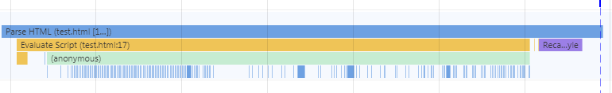
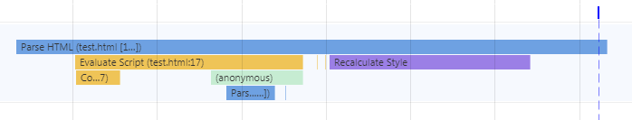
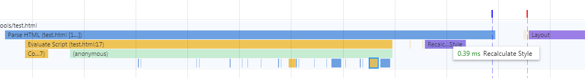
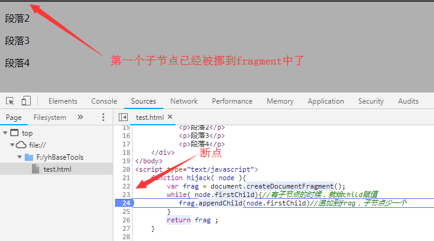
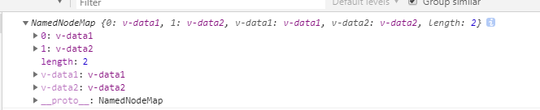

# 节点劫持

## 知道节点劫持之前

要在网页上创建节点，最开始年轻的我是这样做的

```js
    for( var i = 0 ; i<100 ;i++ ){
        var node = document.createElement('div'); 
        node.innerHTML = i;
        document.body.appendChild( node )
    }
```

现在看起来只想问自己一句： 你四不四傻？ 如此操作DOM，浏览器要不断重绘，影响性能。
看看渲染过程。
  
  * 上图黄色部分表示执行JS，蓝色标志paresHTML,执行JS时，解析网页的进程被阻塞。所以我们看到蓝色部分也是一段一段的。也就是说，在 `document.body.appendChild` 这行代码执行后，DOM树就要被修改，在body元素之后添加一个div元素，执行百次循环，DOM树就要被修改100次。
  

后来，为了防止重绘，自以为聪明的我又是这样做的

```js
      var html = '';
        for( var i = 0 ; i<100 ;i++ ){
                html+= '<div>'+i +'</div>' ;
            }

    document.body.innerHTML = html ;

 
```
 
* 用拼接字符串的方式至少不会产生很多段的蓝条，而是一条完整的蓝条（JS只在拼接字符串时阻塞）,DOM树在JS执行完毕后一次性插入body中，因此也只会出现一次重绘;

* 虽有进步，但是这样的方式是不优雅的。you know,拼接字符串是一个多么老土且古板的做法，修改起来也非常费劲。


## 迎接实现劫持的主角 documentFragment

通俗解释： 这是一个没有爸爸的孩子群。浏览器不会渲染，只是保存在内存中。
比如：

    "<li>1<li>"
    "<li>2<li>"
    "<li>3<li>"


重要的是，他继承了Node类，完全可以操作Node那样操作该对象。并且子元素插入到文档片段中不会引起页面回流，这样一来，既避免了用字符串拼接的方式生成html代码，还可以像操作dom元素那样为元素操作这（未渲染）的节点。

知道了`documentFragment` 这个对象之后，升级后的我是这样做的

```js
// 用fragment保存代码片段
 var fragment = document.createDocumentFragment();
    for( var i = 0 ; i<10 ;i++ ){
            var node = document.createElement('div');
            node.innerHTML = i ;
            node.style.height = Math.floor(  Math.random()* 100 )  +'px'; //随机生成高度
            fragment.appendChild( node )
        }
 
    document.body.appendChild( fragment )

```
浏览器渲染的过程如下：
 

也就是说，将节点存储在内存后（而非只是存储字符串），再加入body中。


## documentFragment 是如何劫持DOM的
在上面的代码中，创建了`dom`节点并保存在`fragment`中。那所谓 `劫持` 又是什么呢？

经实验，当把DOM节点用appendChild加入到文档片段后，HTML原本已经渲染好的dom节点就会消失。这应该就是“劫持”;

```html
    <body>
        <div id="containter">
            <p>段落1</p>
            <p>段落2</p>
            <p>段落3</p>
            <p>段落4</p>
        </div>
   </body>
```
```js
    //劫持函数
    function hijack( node ){
        var frag = document.createDocumentFragment();
        while( node.firstChild){//有子节点的时候，就给child赋值
           frag.appendChild(node.firstChild)//追加到frag，子节点少一个
        }
        return frag ;
    }

   hijack( document.getElementById("containter") ) ;

```

那么，在劫持之前，浏览器会渲染HTML的DOM节点，答案是肯定的。因为HTML的解析过程是自上而下的，因此在未解析到JS代码时，`containter`中的节点已经被解析和渲过了。

 


## 节点劫持的作用

节点劫持能保存渲染的子节点，当然也包括节点属性，这非常方便我们获得属性组。

完善上节的代码


```html
    <body>
        <div id="containter">
            <p v-data1="data1" v-data2 ="data2">段落1</p>
            <p>段落2</p>
            <p>段落3</p>
            <p>段落4</p>
        </div>
   </body>
```

```js
  function hijack( node ){
        var frag = document.createDocumentFragment();
        var child ; 
        while( child = node.firstChild){//有子节点的时候，就给child赋值
            if(child.nodeType === 1){//如果是元素节点
                var attr = child.attributes;
                console.log( attr )
            }
           frag.appendChild( child )//追加到frag，子节点少一个
        }
        return frag ;
    }

```

执行结果：

 


非常方便地获取到了节点属性对象。

再仔细思考一下，v-data1 ,v-data2,是不是很像vue中的用法，这不就是vue中使用的指令么~~ 我们可以利用节点文档的特性，自己实现类似vue的功能。不过关于vue的学习就不再这篇文章中详述了，小vue的学习会在
<a>待添加</a>中叙述。


## 参考资料
<a  href="https://www.cnblogs.com/caizhenbo/p/6679478.html">1、DOMContentLoaded与load的区别</a>

<a  href="https://www.jianshu.com/p/e8a356da8db9">2、从documentfragement到实现手写vue</a>

<a  href="https://developer.mozilla.org/zh-CN/docs/Web/API/DocumentFragment">3、Mozilla开发者社区 DocumentFragment类文档</a>

